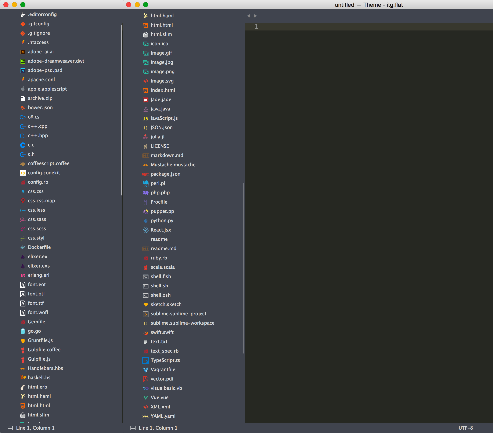

# itg.flat Side Bar Icons

This is not Package.

When using theme the [Theme - itg.flat](https://github.com/itsthatguy/theme-itg-flat) Sublime Text, Add sidebar icons.

## Install

1. [Download the .zip](https://github.com/sou-lab/itg.flat-Icons-Sublime/archive/master.zip).
2. Unzip and Copy the folder into `Packages/User` directory, which you can find using the menu item `Preferences -> Browse Packages...` in Sublime Text.
3. rename the unzipped folder to "Theme - itg.flat"

### Credits
- [Theme - itg.flat](https://github.com/itsthatguy/theme-itg-flat) Sublime Text
- Folked by [SetiUI-Icons-Sublime](https://github.com/mrmartineau/SetiUI-Icons-Sublime)
- Seti UI port by [ctf0](https://github.com/ctf0/Seti_ST3)
- Theme is originally by [jesseweed](https://github.com/jesseweed/seti-ui) for Github's Atom editor.

# Notes
- There is a folder included with some files types from `jesseweed` and `DanBrooker` to test the icons.
- Anything less than 'ST3 Build 3103' wont get the sidebar icons to work.

### Differences from the original

- No file icon in the opened tabs, ST lacks this.
- Not as icon rich as the original because ST can't see anything other than Extensions ,and even though its still hard to use the icon you want.

